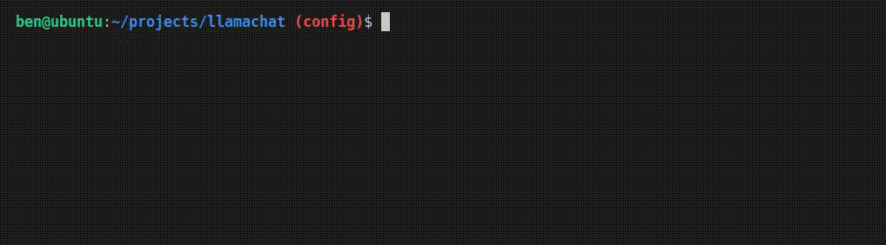

# 🦙llamachat

**MVP for learning & experimenting with local open-weight LLMs**

Simulated chat between two users (Alice & Bob) roleplayed by [Gemma 3 4B Q4_0](https://ollama.com/library/gemma3:4b) using Ollama. 

The model performs surprisingly well on an older Intel i5 CPU without a GPU.



## Requirements

- Docker & Docker Compose
- Tested on Ubuntu 22.04

## Workflow

```shell
make build
make up
make run
make down
```
